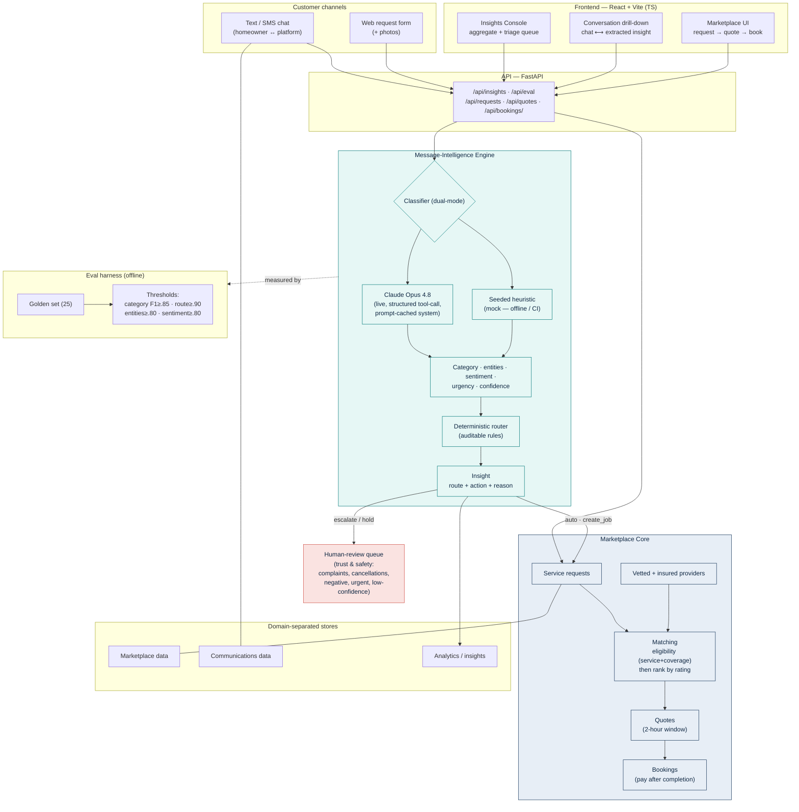

# HouseAccount — Architecture Diagram

End-to-end architecture of the trust-first marketplace plus the
message-intelligence engine. Mirrors the built system 1:1 (FastAPI backend +
React frontend, dual-mode Claude Opus / seeded mock, deterministic routing).

## Key flows

1. **Chat → insight → action.** A customer text is classified (Opus or mock),
   entities/sentiment/urgency extracted, then a *deterministic* router decides
   `auto` vs `human_review` and the action. Low-risk new requests auto-create a
   marketplace job; everything risky is held for a human.
2. **Marketplace.** Requests match to vetted, insured providers by eligibility
   then rating; providers quote within a 2-hour window; the homeowner accepts a
   quote to create a booking; payment is after completion.
3. **Measured quality.** The engine is gated by an offline eval against a
   hand-verified golden set — the quality claim is a number, not an assertion.
